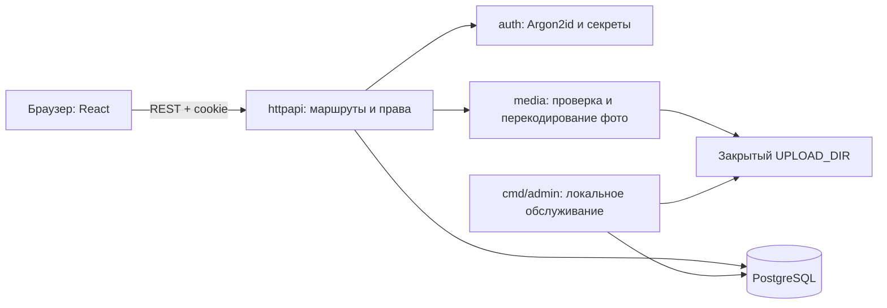

# Как ревьюить SweetNet

Итоговая ветка — `codex/04-release`. `main` не изменён. Ветки последовательные:
каждая включает предыдущую. Опубликованный ранее коммит `4187bc1` сохранён без
переписывания; в нём уже были backend, frontend и инфраструктура.

| Ветка | Что смотреть |
| --- | --- |
| `codex/01-foundation` | Требования, схема PostgreSQL, миграции, конфигурация, примитивы паролей/секретов |
| `codex/02-backend-api` | Исходная полная реализация: аккаунты, API, посты/фото, React, Docker и первые тесты |
| `codex/03-web-app` | Исправления состояния интерфейса, читаемое форматирование, расширенные браузерные тесты и визуальная проверка |
| `codex/04-release` | Строгая валидация, сохранность изображений при сбое COMMIT, ограничение Argon2, CI, восстановление и инструкция |

Не нужно переключать ветки, чтобы читать разницу:

```sh
git log --oneline --decorate main..codex/04-release
git diff codex/01-foundation..codex/02-backend-api -- backend/
git diff codex/01-foundation..codex/02-backend-api -- web/src/
git diff codex/02-backend-api..codex/03-web-app
git diff codex/03-web-app..codex/04-release
```

## Карта кода



| Начать с файла | Назначение |
| --- | --- |
| `backend/cmd/server/main.go` | Конфигурация, PostgreSQL pool, блокировка обслуживания, HTTP, завершение процесса |
| `backend/internal/httpapi/server.go` | Все маршруты, cookie, Origin, активная сессия, owner, ошибки, лимиты |
| `backend/internal/httpapi/accounts.go` | Регистрация в транзакции, приглашения, вход/выход, профиль, отключение |
| `backend/internal/httpapi/posts.go` | Лента, права автора, транзакции постов, связка файлов и БД |
| `backend/internal/media/media.go` | Реальный формат JPEG/PNG, размеры, удаление метаданных |
| `backend/migrations/00001_initial.sql` | Таблицы, внешние ключи, индексы, единственный owner |
| `backend/cmd/admin/main.go` | CLI миграций/создания владельца/сброса пароля/сверки файлов |
| `web/src/App.tsx` | Маршруты и доступ к страницам |
| `web/src/lib/api.ts` | Один HTTP-клиент, отмена запросов и реакция на 401 |
| `web/src/components/AuthProvider.tsx` | Состояние сессии и очистка интерфейса |
| `web/src/features/` | Страницы: вход, лента, редактор, профиль, администрирование |
| `web/src/components/` | Общие поля, кнопки, диалог, статья и приватное изображение |
| `api/openapi.yaml` | Публичный договор между React и Go |
| `compose.yaml`, `Dockerfile` | Сборка frontend/Go, PostgreSQL → миграции → приложение |
| `scripts/backup.sh`, `scripts/restore.sh` | Согласованная копия и восстановление только в новое окружение |

SQL находится рядом с серверным сценарием, поэтому проверки прав и границы
транзакций видны в одном месте. Для такого масштаба отдельные repository/service
слои не добавлялись. Криптография и декодирование изображений вынесены отдельно.
Во frontend App объединяет маршруты; страницы и повторяемые компоненты разделены.

## На что обратить внимание

1. Один круг: **все** активные участники читают всю историю. Приглашает только owner.
2. Фото выдаёт защищённый обработчик; знание URL не даёт гостю доступ.
3. Сессии хранятся в PostgreSQL как хеши случайных секретов. Отключение и смена
   пароля отзывают их. Нет JWT и публичного административного API.
4. Обновление поста требует явный строковый `body`: пустой JSON не стирает текст.
5. Сбой ответа COMMIT оставляет возможные сироты для offline-сверки, чтобы не
   удалить фотографию уже сохранённого поста. Сверка отказывается работать при запущенном сервере.
6. В UI редактирование и просмотр — разные экземпляры страницы: после сохранения
   виден свежий текст. Ошибка отправки сохраняет черновик в памяти текущей формы.
7. Ветка содержит тесты и CI, но успешный запуск CI на GitHub не заявляется до
   реального выполнения workflow. Подробные локальные результаты — в PROGRESS.md.

## Воспроизводимые доказательства

- `backend/internal/httpapi/integration_test.go`: настоящая PostgreSQL, права,
  приглашения/гонки, сессии, ошибки, пагинация и атомарность загрузок.
- `backend/internal/media/media_test.go`: EXIF, подмена MIME, байтовые/пиксельные лимиты.
- `tests/specs/`: два пользователя, гость, desktop/mobile, клавиатура, редактор,
  смена пароля и проверка ответов по схемам OpenAPI.
- `tests/verify-backup.mjs`: реальные PostgreSQL dump/restore, файлы и проверка
  доступа после восстановления; не требует Docker.
- `deploy/tests/`: 17 проверок отказов, guard-условий и порядка Docker-скриптов.
- `tests/verify-compose.mjs`: полный контейнерный прогон для машины с Docker Engine.

Скриншоты в `docs/design/` содержат только синтетические тестовые аккаунты и фото.
В приложении нет автоматически добавляемых записей. Не включены в v1: лайки,
комментарии, чат, email, несколько групп и публичные публикации.
